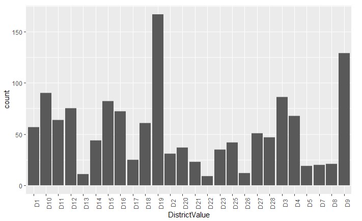
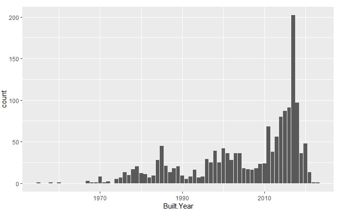

# [Real Estates of Singapore](https://www.visitsingapore.com/en/)
Data exploration and hypothesis testing to better inform buyers and real estate agents on the real estate market trends.

# Web Scraping
Tweaked the web scraper github repo (above) to scrape 2000 job postings from srx.com.sg. With each job, I got the following:

* Address
* Lat
* Long
* Area
* Asking
* Bathrooms
* Bedrooms
* Built Year
* Developer
* District
* facilities
* Floor
* Furnish
* HDB Town
* Model
* No. of Units
* Property Name
* Property Type
* PSF
* Tenure
* X-Valuation

# Data Cleaning

After scraping the data, I needed to clean it up so that it was usable for our model. I made the following changes and created the following variables:

* Parsed numeric data out of asking price of houses
* Parsed numeric data out of price per square foot (psf) 
* Parsed numeric data out of area
* Added a new column for district value

# EDA
I looked at the distributions of the data and the value counts for the various categorical variables. Below are a few highlights from the pivot tables.

*Distribution of by

# Hypothesis 1
## The supply of some property types is higher in some districts. 

From the heatmap, insights can be derived on the type of properties for sale within each district and compare property types within districts:
* Little difference in the number of count for terrace, semi-detached and detached houses across the districts
* The number of condominiums up for sale is the highest in district 9 and that for apartments is in district 19

# Hypothesis 2 
## Cost psf will be affected by the district and property type.

From the geographical map, I observe that:
* District 7, 8 and 9 tend to have high average psf while district 25 appear to have the lowest average psf
* It is not surprising to see that most of the houses in district 9 are bigger since earlier it was uncovered that there is a high concentration of condominiums up for sale in district 9; this alludes to suppliers of condominiums building houses that are larger than average to meet the needs of wealthier buyers

* The boxplot shows the distribution of psf depending on the property type. It appears that apartments and condominium are generally more expensive. This explains why houses in district 9, which are mainly condominums, are expensive
* Even though district 19 has the highest number of apartments, it is not as expensive compared to district 1, 2 & 9

# Hypothesis 3
## The psf of a property is affected by its lease type.

.jpg)

The results were segmented based on the property types to tease apart the impact of property types on psf, isolating the effects of tenure type on psf. 

From the results, it is observed that:
* Only non-HDB properties have tenure types that are different from the 99-year lease, with the exception of an anomaly under HDB 4 Rooms
* Apartment and Condominium have large variances in their psf
* Based on non-HDB properties, there is no clear correlation between tenure types and psf

# Hypothesis 4
## The psf of a property is affected by its extent of furnishing, whereby a furnished property is more expensive than a non-furnished one.

.jpg)

.jpg)

The analysis segments the data based on their property types to isolate the impact of extent of furnishing on psf. Two separate analyses were then conducted to look at the impact for non-HDB properties and HDB properties since these groups have different psf ranges. 

From the results, it is observed that each property type is consistent with the hypothesis. A property that is unfurnished generally has a lowered mean psf than a property that is partially or fully furnished across all property types

# Hypothesis 5
## HDBs sold will generally be older as compared to Private Property. 

* I posit that new property that are sold are often made from an investment perspective. 
* Due to the certain government measures in place, HDBs are not ideal assets to be traded for investment gains. 
* As such, it is likely that most investment properties are private properties. 
* The graph plotted actually backs the hypothesis: for homes built in the last 5 years, only a very small proportion represents HDBs. 

# Hypothesis 6
## The relationship between asking price and area is different amongst the different property types. 

.jpg)

* When comparing the different private properties, apartments and condominiums (private non-landed) has a strong upward slopping relationship between their asking price and area
* In that sense, bigger condos and apartments tend to yield higher prices
* However, this relationship starts to dwindle when applied to landed properties such as terraces, semi-detach and bungalows

.jpg)

The analysis on HDBs yield us some interesting results. 
* Firstly, from the graph, it appears that many HDBs are of the same size 
* This could be due to the standardized blueprints that HDB employs
* However, for HDBs of different sizes, there was no clear relationship between area and price
* Perhaps the main factor that ultimately affects the price of HDBs is the location, and not the area per se

# Hypothesis 7
## As area of the property increases, the asking price increases.

_vs_Area_(by_Property_Type).jpg)

The area and logarithm of the asking price were plotted to uncover their relationship. 

From the graph, I observed that:
* The correlation is highest among the property type – Apartment
* However, in contrast with the HDB room types, the trend is not as strong
* Hence, I cannot conclude that the hypothesis is applicable to all housing types

